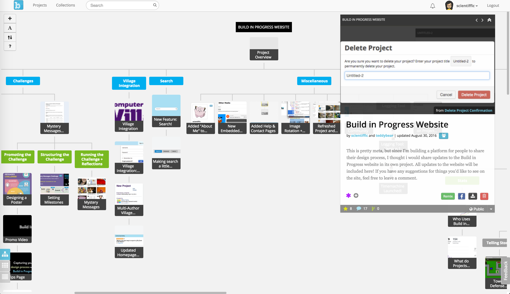

# Build In Progress Web Application

This repo is an open source version of Build in Progress, a project management platform for capturing and sharing work-in-progress.  Using Build in Progress, you can visualize how your projects evolve over time using branches:

Other features built into Build in Progress include:

* Commenting on projects
* Multi-author projects
* Privacy settings for project sharing
* Ability to ask questions to gather feedback
* Project Collections
* Multiple viewing modes for project pages, including an image gallery and blog mode

To get started, please refer to the documentation at https://github.com/ttseng/Build-in-Progress-Web/wiki
